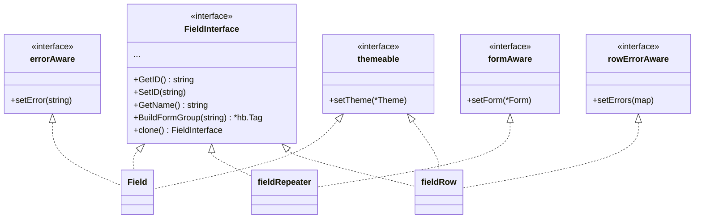

# Architecture

## Package Structure

The library is a single Go package (`form`) with a flat file layout. All types live in the `form` package namespace.

```
form/
├── consts.go                  # Field type constants
├── field.go                   # Field struct, rendering logic, BuildFormGroup
├── field_constructors.go      # Type-safe constructors (NewStringField, etc.)
├── field_fluent.go            # Fluent With* methods for Field
├── field_interface.go         # FieldInterface definition
├── field_option.go            # FieldOption key-value pair
├── field_repeater.go          # Repeater field (dynamic add/remove groups)
├── field_row.go               # FieldRow for multi-column grid layouts
├── form.go                    # Form struct, Build(), internal interfaces
├── form_fluent.go             # Fluent With* methods for Form + New()
├── htmx.go                    # HTMXConfig struct
├── new_field.go               # NewField() options-based constructor
├── new_form.go                # NewForm() options-based constructor
├── new_repeater.go            # NewRepeater() options-based constructor
├── test_helpers.go            # Test assertion helpers
├── theme.go                   # Theme struct, Bootstrap5, Tailwind presets
├── validation.go              # Validators and Form.Validate()
├── *_test.go                  # Test files
├── Taskfile.yml               # Task runner configuration
└── go.mod / go.sum            # Go module files
```

## Core Design Patterns

### Builder Pattern (Fluent API)

Both `Form` and `Field` use the builder pattern. Methods return `*Form` or `*Field` to enable chaining:

```go
form.New().WithID("f").WithFields(
    form.NewStringField("name", "Name").WithRequired().WithPlaceholder("..."),
)
```

### Interface Segregation

The library uses several small internal interfaces to decouple concerns:



- **`FieldInterface`** — Public contract for all field types (17 methods)
- **`formAware`** — Internal; fields that need a parent form reference (repeater)
- **`themeable`** — Internal; fields that accept a theme
- **`errorAware`** — Internal; fields that display inline errors
- **`rowErrorAware`** — Internal; layout fields that distribute errors to children

### Strategy Pattern (Theming)

The `Theme` struct acts as a strategy for CSS class selection. The form passes the active theme to each field during `Build()`. Fields use `field.getTheme()` to resolve classes, falling back to the default Bootstrap 5 theme.

### Factory Pattern (Field Constructors)

Type-safe constructors like `NewStringField()`, `NewEmailField()` act as factories that pre-set the field type constant, reducing errors.

### Validator Functions

Validators use a functional pattern — each validator is a `func(fieldName, value string) *ValidationError`. This allows composition:

```go
field.WithValidators(
    form.ValidatorRequired(),
    form.ValidatorMinLength(3),
    form.ValidatorPattern(`^[a-z]+$`, "lowercase only"),
)
```

## Key Architectural Decisions

1. **Single Package** — No sub-packages. Everything is in `package form` for simplicity and zero import friction.

2. **HTML Builder (hb)** — Forms render via `dracory/hb` tags, not Go templates. This gives type-safe HTML construction with method chaining.

3. **Dual API** — Both options-struct (`NewForm(FormOptions{...})`) and fluent (`New().WithID(...)`) constructors coexist for backward compatibility.

4. **Internal Interfaces** — `formAware`, `themeable`, `errorAware` are unexported. The `Build()` method uses type assertions to optionally inject dependencies into fields that implement them.

5. **Default Theme** — Bootstrap 5 is the package-level default (`defaultTheme`). No configuration needed for the common case.

6. **Validation on Form** — `Form.Validate()` iterates fields, runs validators, and stores errors internally. Calling `Build()` after `Validate()` renders errors inline.

## See Also

- [Overview](overview.md)
- [Data Flow](data_flow.md)
- [API Reference](api_reference.md)
- [Modules: Form](modules/form.md)
