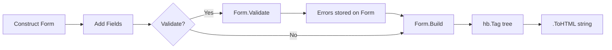
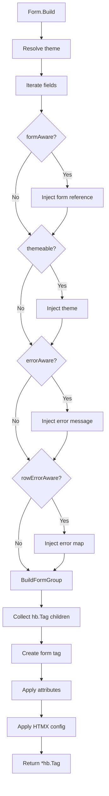

# Data Flow

## Overview

Data flows through the form library in three main phases: **Construction**, **Validation** (optional), and **Rendering**.



## Phase 1: Construction

Forms and fields are created using either the fluent API or options-based constructors.

```go
// Fluent API
f := form.New().
    WithID("myForm").
    WithTheme(form.ThemeTailwind()).
    WithFields(
        form.NewStringField("name", "Name").WithRequired(),
    )

// Options API
f := form.NewForm(form.FormOptions{
    ID:     "myForm",
    Fields: []form.FieldInterface{...},
})
```

At this point, the `Form` struct holds:
- Field list (`[]FieldInterface`)
- Configuration (ID, class, method, action URL)
- Theme reference (or nil for default)
- HTMX settings

## Phase 2: Validation (Optional)

When `Form.Validate(values)` is called:

```mermaid
flowchart TD
    A[Form.Validate] --> B[Iterate fields]
    B --> C{Is *Field?}
    C -->|No| B
    C -->|Yes| D{Required & empty?}
    D -->|Yes| E[Add required error]
    D -->|No| F[Run field.Validators]
    F --> G{Validator returns error?}
    G -->|Yes| H[Add ValidationError]
    G -->|No| B
    E --> B
    H --> B
    B --> I[Build error map]
    I --> J[Store on form.errors]
    J --> K[Return []ValidationError]
```

1. Iterates all fields (only `*Field` types, not repeaters/rows)
2. Checks `Required` flag first — if empty, adds error and skips validators
3. Runs each `Validator` function against the submitted value
4. Collects all `ValidationError` structs
5. Builds a `map[string]string` (field name → first error message)
6. Stores the map on `form.errors` for inline display during rendering

## Phase 3: Rendering (Build)

When `Form.Build()` is called:



### Field Rendering (BuildFormGroup)

Each field's `BuildFormGroup(fileManagerURL)` method:

1. **Raw fields** — Return `hb.NewHTML(value)` directly
2. **Normal fields**:
   - Auto-generate ID if empty (`"id_" + uid.HumanUid()`)
   - Create the input element based on field type (switch statement)
   - Apply readonly/disabled attributes
   - Apply custom `Attrs`
   - Wrap in form group div with label, error message, and help text

### Theme Resolution

```
field.getTheme() → field.theme (if set) → defaultTheme (Bootstrap 5)
```

The form injects its theme into each field during `Build()`. If no theme is set on the form, the package-level `defaultTheme` (Bootstrap 5) is used.

### Error Display Flow

```
Form.Validate() → form.errors map
Form.Build() → injects error to each errorAware field
Field.BuildFormGroup() → adds ErrorInputClass to input + ErrorClass div with message
```

For `fieldRow`, errors are distributed to child fields via `rowErrorAware.setErrors()`.

## See Also

- [Architecture](architecture.md)
- [Modules: Form](modules/form.md)
- [Modules: Validation](modules/validation.md)
- [Modules: Theme](modules/theme.md)
