# Module: Form

## Purpose

The `Form` struct is the top-level container that holds fields, configuration, theme, and HTMX settings. Its `Build()` method orchestrates the rendering pipeline — injecting themes, errors, and form references into fields before rendering them into an HTML `<form>` tag.

## Key Types

### Form

```go
type Form struct {
    id             string
    className      string
    fields         []FieldInterface
    fileManagerURL string
    method         string
    actionUrl      string
    hxPost         string
    hxTarget       string
    hxSwap         string
    theme          *Theme
    errors         map[string]string
    htmxConfig     *HTMXConfig
}
```

All fields are unexported — access is via getter/setter or fluent methods.

### FormOptions

```go
type FormOptions struct {
    ActionURL      string
    ClassName      string
    ID             string
    Fields         []FieldInterface
    FileManagerURL string
    Method         string
    HxPost         string
    HxTarget       string
    HxSwap         string
}
```

### Internal Interfaces (defined in form.go)

| Interface | Method | Implemented By | Purpose |
|-----------|--------|---------------|---------|
| `formAware` | `setForm(*Form)` | `fieldRepeater` | Inject parent form reference |
| `themeable` | `setTheme(*Theme)` | `Field`, `fieldRow` | Inject theme |
| `errorAware` | `setError(string)` | `Field` | Inject error message |
| `rowErrorAware` | `setErrors(map)` | `fieldRow` | Distribute errors to children |

## Dependencies

- `github.com/dracory/hb` — HTML tag builder
- `net/http` — For `http.MethodPost` default

## Build() Pipeline

```mermaid
sequenceDiagram
    participant Caller
    participant Form
    participant Field
    participant hb

    Caller->>Form: Build()
    Form->>Form: Resolve theme (or default)
    loop Each field
        Form->>Field: setForm() (if formAware)
        Form->>Field: setTheme() (if themeable)
        Form->>Field: setError() (if errorAware + has error)
        Form->>Field: setErrors() (if rowErrorAware)
        Form->>Field: BuildFormGroup(fileManagerURL)
        Field-->>Form: *hb.Tag
    end
    Form->>hb: Create <form> tag
    Form->>hb: Set method, action, id, class
    Form->>hb: Set HTMX attributes
    Form-->>Caller: *hb.Tag
```



## Usage Examples

### Fluent API

```go
f := form.New().
    WithID("myForm").
    WithClass("needs-validation").
    WithAction("/submit").
    WithTheme(form.ThemeTailwind()).
    WithFields(
        form.NewStringField("name", "Name").WithRequired(),
        form.NewEmailField("email", "Email"),
    )

html := f.Build().ToHTML()
```

### Options API

```go
f := form.NewForm(form.FormOptions{
    ID:        "myForm",
    ClassName: "needs-validation",
    ActionURL: "/submit",
    Method:    "POST",
    Fields:    []form.FieldInterface{...},
})
```

### With Validation

```go
errors := f.Validate(submittedValues)
if len(errors) > 0 {
    // Re-render form with inline errors
    html := f.Build().ToHTML()
}
```

## Files

| File | Contents |
|------|----------|
| `form.go` | `Form` struct, `Build()`, internal interfaces, getter/setters |
| `form_fluent.go` | `New()`, all `With*` methods |
| `new_form.go` | `NewForm()`, `FormOptions` |

## See Also

- [Architecture](../architecture.md)
- [Data Flow](../data_flow.md)
- [Module: Field](field.md)
- [Module: Theme](theme.md)
- [Module: HTMX](htmx.md)
