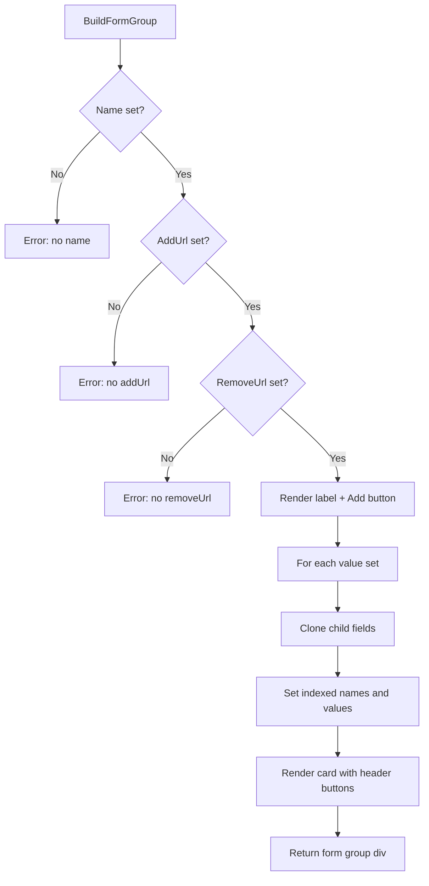

# Module: Repeater

## Purpose

The repeater field (`fieldRepeater`) allows users to dynamically add, remove, and reorder groups of fields. Each group contains the same set of child fields, populated with different values. Operations (add, remove, move up, move down) are powered by HTMX POST requests.

> **Note:** This module is still under active development.

## Key Types

### fieldRepeater (unexported)

```go
type fieldRepeater struct {
    form                *Form
    repeaterAddUrl      string
    repeaterMoveUpUrl   string
    repeaterMoveDownUrl string
    repeaterRemoveUrl   string
    fieldHelp           string
    fieldID             string
    fieldLabel          string
    fieldType           string
    fieldName           string
    fieldValue          string
    fields              []FieldInterface
    values              []map[string]string
}
```

### RepeaterOptions

```go
type RepeaterOptions struct {
    Label               string
    Type                string
    Name                string
    Value               string
    Help                string
    Fields              []FieldInterface
    Values              []map[string]string
    RepeaterAddUrl      string
    RepeaterMoveUpUrl   string
    RepeaterMoveDownUrl string
    RepeaterRemoveUrl   string
}
```

## How It Works

### Construction

```go
repeater := form.NewRepeater(form.RepeaterOptions{
    Name:  "items",
    Label: "Order Items",
    Fields: []form.FieldInterface{
        form.NewStringField("product", "Product"),
        form.NewNumberField("quantity", "Qty"),
    },
    Values: []map[string]string{
        {"product": "Widget A", "quantity": "5"},
        {"product": "Widget B", "quantity": "10"},
    },
    RepeaterAddUrl:      "/api/repeater/add",
    RepeaterRemoveUrl:   "/api/repeater/remove",
    RepeaterMoveUpUrl:   "/api/repeater/move-up",
    RepeaterMoveDownUrl: "/api/repeater/move-down",
})
```

### Rendering



### Field Name Convention

Child field names are transformed to array notation:

```
repeaterName[childFieldName][]
```

For example, with repeater name `"items"` and child field `"product"`:
```
items[product][]
```

### Field ID Convention

Child field IDs are suffixed with item and field indices:

```
originalID_itemIndex_fieldIndex
```

For example: `ID_1_0_0`, `ID_1_1_0`, `ID_2_0_1`

### HTMX Buttons

Each repeater group renders with action buttons:

| Button | HTMX Action | Query Parameter |
|--------|-------------|-----------------|
| **Add** | `hx-post` to `repeaterAddUrl` | None |
| **Remove** | `hx-post` to `repeaterRemoveUrl` | `repeatable_remove_index=N` |
| **Move Up** | `hx-post` to `repeaterMoveUpUrl` | `repeatable_move_up_index=N` |
| **Move Down** | `hx-post` to `repeaterMoveDownUrl` | `repeatable_move_down_index=N` |

All buttons use:
- `hx-include="#formID"` — Sends current form data
- `hx-target="#formID"` — Replaces the form content

### Rendered HTML Structure

```html
<div class="form-group mb-3">
  <label class="form-label">
    Order Items
    <button class="btn btn-sm btn-primary ms-3 float-end"
            hx-include="#formID" hx-post="/api/repeater/add" hx-target="#formID">
      <i class="bi bi-plus"></i> Add new
    </button>
  </label>

  <!-- Card for each value set -->
  <div class="card w-100 mb-3">
    <div class="card-header">
      <button class="btn btn-sm btn-default" hx-post="/api/repeater/move-up?...">
        <i class="bi bi-arrow-up-circle"></i>
      </button>
      <button class="btn btn-sm btn-default" hx-post="/api/repeater/move-down?...">
        <i class="bi bi-arrow-down-circle"></i>
      </button>
      <button class="btn btn-sm btn-danger float-end" hx-post="/api/repeater/remove?...">
        <i class="bi bi-trash"></i>
      </button>
    </div>
    <div class="card-body">
      <!-- Cloned child fields rendered here -->
    </div>
  </div>
</div>
```

## Interface Implementations

```go
var _ FieldInterface = (*fieldRepeater)(nil)
var _ formAware = (*fieldRepeater)(nil)
```

The repeater implements `formAware` to receive the parent form reference (needed for `hx-include` and `hx-target` with the form ID).

## Error Handling

The repeater renders error alerts for missing configuration:

- Missing `Name` → `"Form Error. Repeater has no name"`
- Missing `RepeaterAddUrl` → `"Form Error. Repeater X has no repeaterAddUrl"`
- Missing `RepeaterRemoveUrl` → `"Form Error. Repeater X has no repeaterRemoveUrl"`

## Files

| File | Contents |
|------|----------|
| `field_repeater.go` | `fieldRepeater` struct, `BuildFormGroup()`, `FieldInterface` implementation |
| `new_repeater.go` | `NewRepeater()`, `RepeaterOptions` |

## See Also

- [Module: Form](form.md)
- [Module: Field](field.md)
- [Module: HTMX](htmx.md)
- [API Reference](../api_reference.md)
- [Troubleshooting](../troubleshooting.md)
