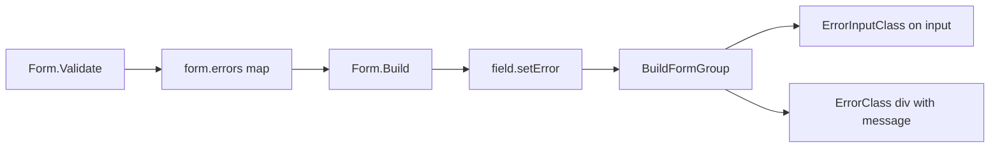

# Module: Validation

## Purpose

The validation module provides a functional validator system and a `Form.Validate()` method that runs validators against submitted values, collects errors, and stores them for inline display during rendering.

## Key Types

### Validator

```go
type Validator func(fieldName string, value string) *ValidationError
```

A function that receives a field name and value, returning `*ValidationError` if invalid or `nil` if valid.

### ValidationError

```go
type ValidationError struct {
    Field   string
    Message string
}
```

## Built-in Validators

### String Validators

| Validator | Description | Example |
|-----------|-------------|---------|
| `ValidatorRequired()` | Non-empty (after trimming) | `ValidatorRequired()` |
| `ValidatorMinLength(n)` | At least `n` characters | `ValidatorMinLength(3)` |
| `ValidatorMaxLength(n)` | At most `n` characters | `ValidatorMaxLength(100)` |
| `ValidatorAlphaNumeric()` | Letters and numbers only | `ValidatorAlphaNumeric()` |

### Numeric Validators

| Validator | Description | Example |
|-----------|-------------|---------|
| `ValidatorMin(n)` | Numeric value >= `n` | `ValidatorMin(0)` |
| `ValidatorMax(n)` | Numeric value <= `n` | `ValidatorMax(999)` |

### Format Validators

| Validator | Description | Pattern |
|-----------|-------------|---------|
| `ValidatorEmail()` | Valid email format | `^[a-zA-Z0-9._%+\-]+@[a-zA-Z0-9.\-]+\.[a-zA-Z]{2,}$` |
| `ValidatorURL()` | Valid HTTP(S) URL | `^https?://[^\s/$.?#].[^\s]*$` |
| `ValidatorIP()` | Valid IPv4 address | `^((25[0-5]\|(2[0-4]\|1\d\|[1-9]\|)\d)\.?\b){4}$` |
| `ValidatorUUID()` | Valid UUID format | `^[0-9a-fA-F]{8}-...-[0-9a-fA-F]{12}$` |
| `ValidatorPattern(pattern, message)` | Custom regex match | Any regex |

### Enum Validator

| Validator | Description | Example |
|-----------|-------------|---------|
| `ValidatorOneOf(allowed...)` | Value must be in set | `ValidatorOneOf("draft", "published")` |

### Custom Validator

```go
ValidatorCustom(func(value string) string {
    if value == "forbidden" {
        return "this value is not allowed"
    }
    return "" // empty = valid
})
```

## Form.Validate()

```go
func (form *Form) Validate(values map[string]string) []ValidationError
```

### Behavior

1. Iterates all fields (only `*Field` types — repeaters and rows are skipped)
2. For each field:
   - If `Required` and value is empty → adds "fieldName is required" error, **skips validators**
   - Otherwise, runs each `Validator` in order
3. Collects all `ValidationError` structs
4. Builds `map[string]string` (field name → first error message)
5. Stores the map on `form.errors` for inline display
6. Returns the full `[]ValidationError` slice

### Important Notes

- Required check happens **before** validators — if a required field is empty, validators are not run
- Only the **first** error per field is stored in the error map (for inline display)
- The full error slice may contain multiple errors per field
- Calling `Validate()` overwrites any previously set errors

## Inline Error Display

After `Validate()` (or `WithErrors()`), calling `Build()` renders errors inline:



The theme controls the CSS classes:
- `ErrorInputClass` — Added to the input element (e.g., `"is-invalid"` for Bootstrap)
- `ErrorClass` — Applied to the error message div (e.g., `"invalid-feedback"` for Bootstrap)

## Usage Examples

### Basic Validation

```go
f := form.New().WithFields(
    form.NewStringField("name", "Name").WithRequired(),
    form.NewEmailField("email", "Email").
        WithValidators(form.ValidatorEmail()),
)

errors := f.Validate(map[string]string{
    "name":  "",
    "email": "not-valid",
})
// errors[0] = {Field: "name", Message: "name is required"}
// errors[1] = {Field: "email", Message: "must be a valid email address"}
```

### Multiple Validators

```go
form.NewPasswordField("password", "Password").
    WithRequired().
    WithValidators(
        form.ValidatorMinLength(8),
        form.ValidatorMaxLength(64),
    )
```

### Manual Error Setting

```go
f.WithErrors(map[string]string{
    "email": "This email is already taken",
})
html := f.Build().ToHTML()
```

## Files

| File | Contents |
|------|----------|
| `validation.go` | `Validator` type, `ValidationError`, 13 built-in validators, `Form.Validate()` |

## See Also

- [Module: Field](field.md)
- [Module: Form](form.md)
- [Module: Theme](theme.md)
- [API Reference](../api_reference.md)
- [Troubleshooting](../troubleshooting.md)
